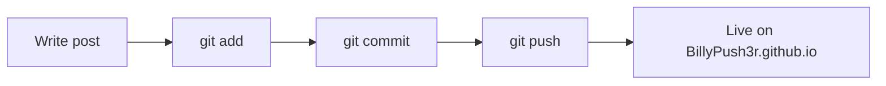

A personal reference for writing and formatting posts consistently. Never published — preview locally with `bundle exec jekyll serve --drafts`.

---

## Front Matter Template

Every post starts with this block:

```yaml
---
title: "Your Post Title"
date: YYYY-MM-DD HH:MM:SS +0100
categories: [Primary, Secondary]   # max 2
tags: [tag-one, tag-two, tag-three]
image:
  path: /assets/img/posts/your-image.jpg
  alt: "Image description"
pin: false        # true = pinned to top of git log
published: true   # false = draft, never deployed
---
```

> Categories map to `git branch` in the nav. Keep it to max 2 per post.
{: .prompt-tip }

---

## Chirpy Prompt Blocks

These are Chirpy-specific and render as styled callout boxes:

```markdown
> This is a tip — use for helpful hints.
{: .prompt-tip }

> This is an info box — use for context or background.
{: .prompt-info }

> This is a warning — use when something can go wrong.
{: .prompt-warning }

> This is a danger box — use for destructive or irreversible actions.
{: .prompt-danger }
```

**Renders as:**

> Tip: use for helpful hints and shortcuts.
{: .prompt-tip }

> Info: use for background context.
{: .prompt-info }

> Warning: use when things could go sideways.
{: .prompt-warning }

> Danger: use for irreversible or destructive actions.
{: .prompt-danger }

---

## Code Blocks

Always specify the language for syntax highlighting:

````markdown
```python
def hello():
    print("shipped")
```

```bash
bundle exec jekyll serve --drafts
```

```yaml
key: value
```

```javascript
const x = () => console.log("works");
```
````

For inline code use backticks: `like this`.

For filenames or paths, also use backticks: `_config.yml`, `_posts/`.

---

## Headings

```markdown
## H2 — Main section (use this as your top-level heading in posts)
### H3 — Subsection
#### H4 — Use sparingly, only when truly needed
```

> Never use `# H1` inside posts — Chirpy uses the `title:` front matter as H1.
{: .prompt-warning }

---

## Images

```markdown
<!-- Basic image -->


<!-- Image with caption (Chirpy renders the alt as caption) -->


<!-- Image with width constraint -->
{: width="700" height="400" }

<!-- Float image to the right -->
{: .right }

<!-- Float image to the left -->
{: .left }
```

Store all post images in `/assets/img/posts/`.

---

## Links

```markdown
<!-- External link -->
[Link text](https://example.com)

<!-- Internal link to another post -->
[Another post]()

<!-- Link that opens in new tab (use sparingly) -->
[Link text](https://example.com){: target="_blank" }
```

---

## Tables

```markdown
| Column A | Column B | Column C |
|----------|----------|----------|
| value    | value    | value    |
| value    | value    | value    |
```

Left / center / right alignment:

```markdown
| Left     | Center   | Right    |
|:---------|:--------:|---------:|
| value    | value    | value    |
```

---

## Task Lists

```markdown
- [x] Done
- [ ] Not done yet
- [ ] Also pending
```

---

## Footnotes

```markdown
Here is a claim that needs a source.[^1]

[^1]: The source or explanation goes here at the bottom.
```

---

## Math (KaTeX)

Inline math: `$E = mc^2$`

Block math:

```markdown
$$
\sum_{i=1}^{n} x_i = \bar{x} \cdot n
$$
```

> Enable math in front matter with `math: true` if not on by default in `_config.yml`.
{: .prompt-tip }

---

## Mermaid Diagrams

````markdown

````

> Enable with `mermaid: true` in front matter if needed.
{: .prompt-tip }

---

## File & Folder Naming

Posts go in `_posts/` and must follow this format exactly:

```
YYYY-MM-DD-slug-with-hyphens.md
```

Examples:

- `2026-06-25-why-microservices-fail.md`
- `2026-07-01-my-stack-mid-2026.md`
- `2026-08-10-null-hypothesis-on-agile.md`

Slugs become the URL: `https://BillyPush3r.github.io/posts/why-microservices-fail/`

---

## Writing Tone Reminders

- Write like you're explaining to a smart peer, not a beginner — but don't gatekeep.
- Opinions are welcome, hedging is not. Say what you think.
- Sarcasm is fine. Meanness isn't.
- Short sentences hit harder than long ones.
- If you can cut a paragraph, cut it.
